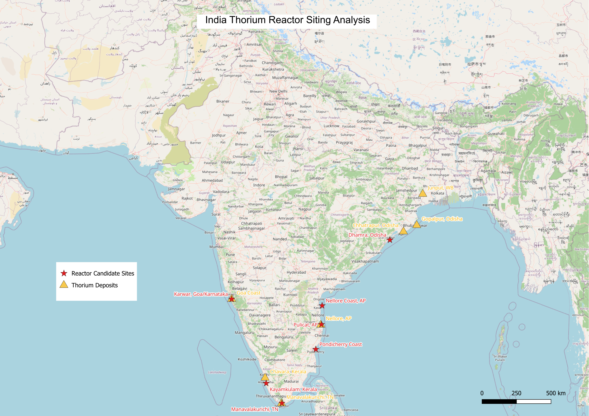

# India Thorium Energy Grid: Geospatial Siting Analysis

## Overview
This project presents a geospatial feasibility study for India’s Three-Stage Nuclear Power Programme, an indigenous strategy designed to leverage India's vast thorium reserves (approx. 25% of global deposits) for long-term energy independence.

The analysis focuses on the transition from Stage 2 (Fast Breeder Reactors) to Stage 3 (Thorium-based Reactors), a milestone India officially entered in April 2026.

## Technical Context: The 2026 Milestone
As of April 6, 2026, the Prototype Fast Breeder Reactor (PFBR) at Kalpakkam achieved first criticality. This reactor marks the initiation of Stage 2, where Plutonium fuel is used to transmute Thorium-232 into Uranium-233. My analysis maps the infrastructure required to scale this transmutation into the final Stage 3 (Advanced Heavy Water Reactors).

## Technical Methodology
1. Data Engineering & Simulation
  I developed a modeled dataset of geographically representative coordinates for:

  Thorium Sources: Coastal monazite sand deposits (Odisha, Andhra Pradesh, Tamil Nadu, and Kerala).

  Nuclear Infrastructure Nodes: Existing PHWR sites and proposed AHWR/Stage 3 candidate sites selected for coastal logistics and water access.

2. Geospatial Workflow (QGIS)
  Coordinate Systems: Handled coordinate transformations from raw simulated CSV data to the WGS 84 (EPSG:4326) standard.

  Symbology: Implemented a categorized vector point system to visualize the supply-chain proximity between thorium-rich mineral belts and reactor sites.

  India-Specific Siting: The map specifically accounts for the Indo-Gangetic Plain's power requirements and the coastal monazite belts of South and East India.

3. Key Analytical Insights
  Supply Chain Proximity: Coastal siting is critical for Stage 3 AHWRs to minimize the logistical footprint of transporting heavy mineral sands from the coastal belts.

  Energy Transition Modeling: The visualization identifies Kalpakkam (Tamil Nadu) as the current primary hub for Stage 2 operations, serving as the "bridge" to the thorium-based future.

## Project Contents
/reactor_sites_qgis, thorium_deposits: Simulated CSV dataset of India's nuclear coordinates.

/thorium_reactor_siting_map: High-resolution export of the siting analysis.

/optimal_thorium_reactor_sites_in_india.qgz: QGIS project file including layer configurations.
